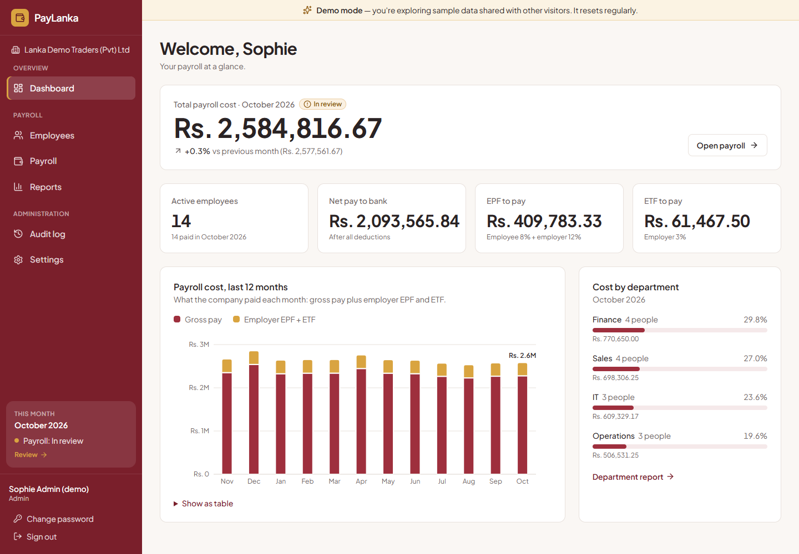
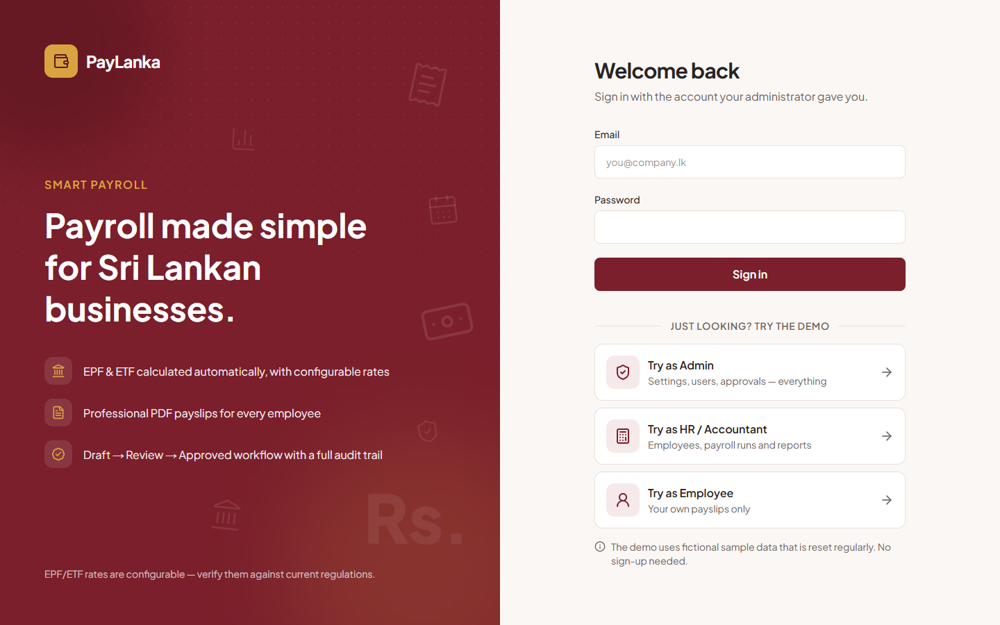
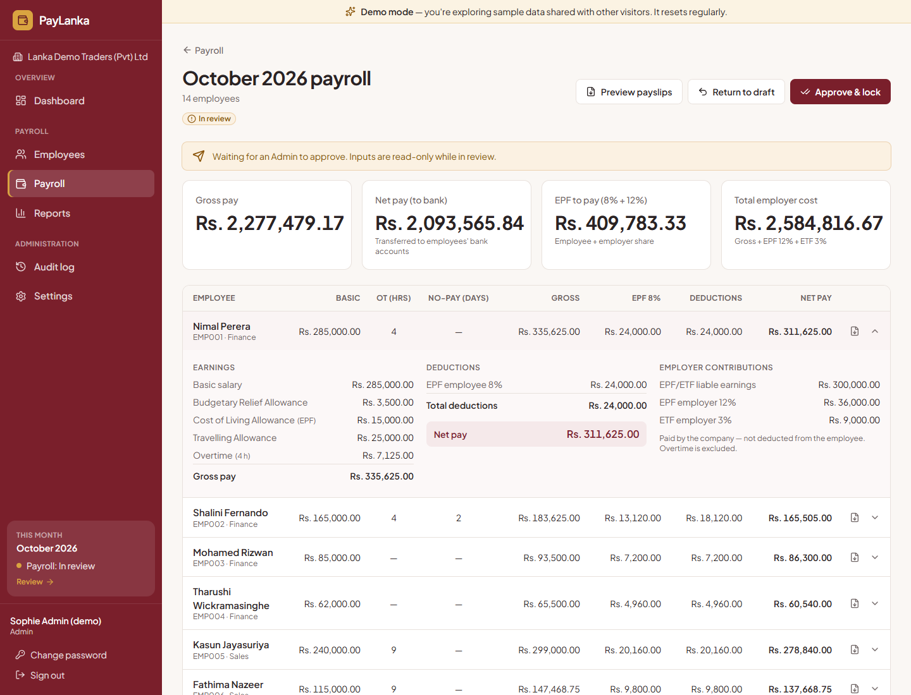
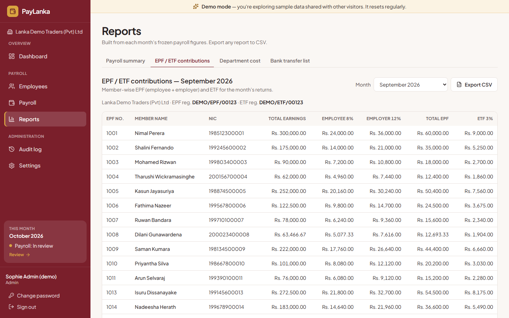
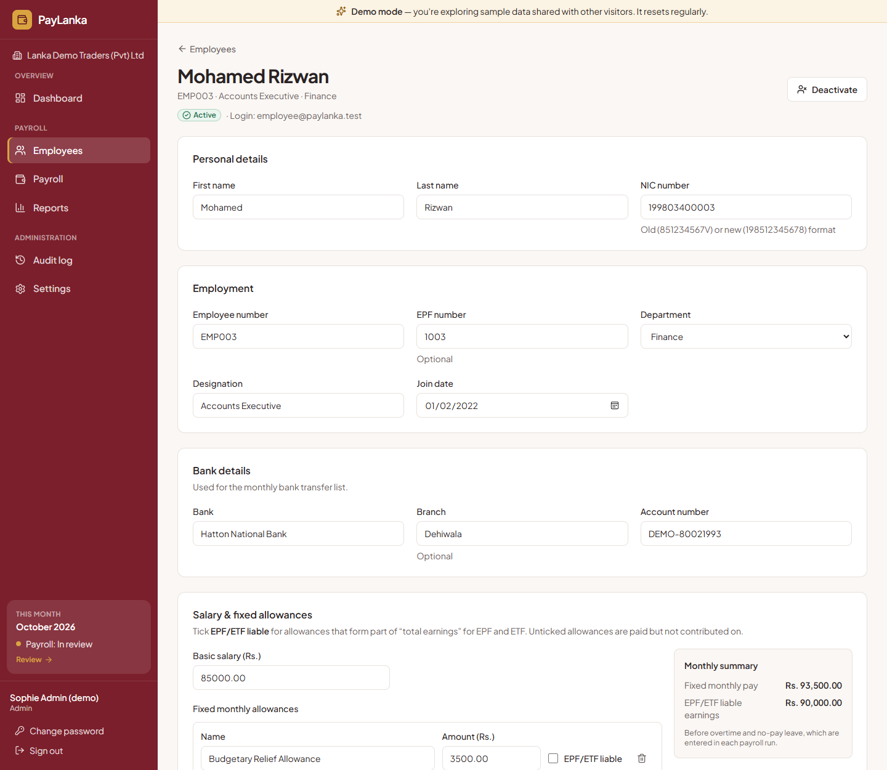
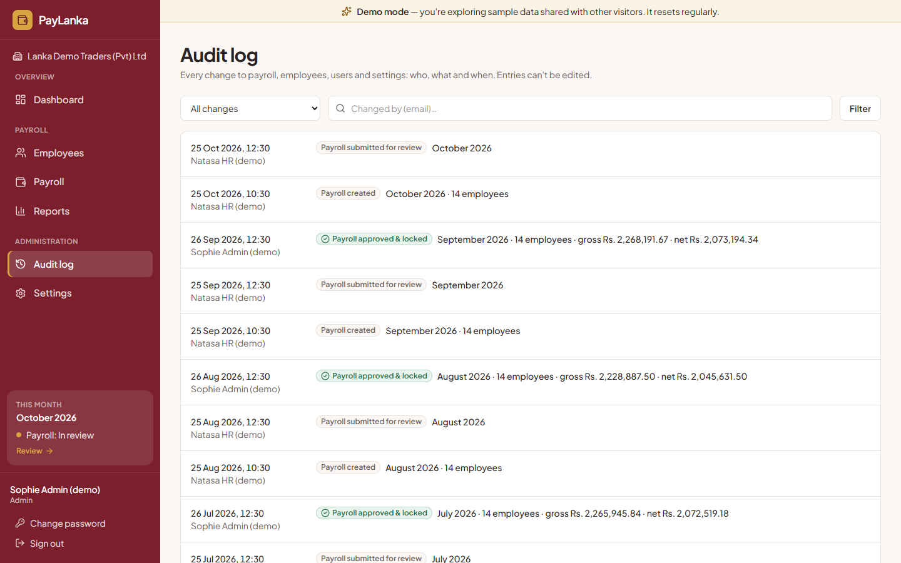
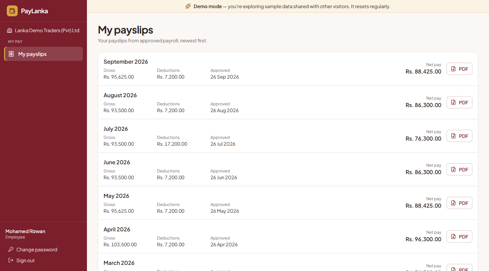

# PayLanka — Smart Payroll Management for Sri Lankan Businesses

PayLanka runs a small or medium company's monthly payroll the Sri Lankan way:
EPF and ETF, overtime and no-pay leave, a Draft → Review → Approved workflow,
professional PDF payslips, statutory and bank reports, and a full audit trail.



> **Live demo: [paylanka.vercel.app](https://paylanka.vercel.app)** — click **Try as Admin / HR / Employee** on the sign-in page.
> All data in the demo is fictional and is reset every night.

---

## Features

- **Company settings** — company details, EPF/ETF registration numbers and **configurable rates**
  (EPF 8% / 12%, ETF 3%, overtime and no-pay divisors), stored in the database, not in code.
- **Employees** — add, edit and deactivate employees with NIC validation (old and new formats),
  EPF number, department, bank details, basic salary and fixed allowances marked *EPF-liable* or not.
- **Monthly payroll** — one run per month; enter overtime hours, no-pay days, one-off allowances
  and deductions (salary advance, loan) with a **live preview** of each employee's pay.
- **Approval workflow** — Draft → In review → Approved & locked. An Admin can return a run with a
  note. Whoever submitted a run can't approve it (segregation of duties).
- **Review checks before approval** — flags net pay changes of 20% or more versus last month, very
  large deductions, negative pay, joiners and leavers, high overtime and no-pay leave.
- **PDF payslips** — earnings, deductions, employer contributions, net pay in figures and words;
  drafts carry a watermark; one PDF per employee or one combined PDF per run.
- **Reports with CSV export** — payroll summary, EPF/ETF contributions, department cost and a bank
  transfer list (approved payroll only).
- **Dashboard** — this month's payroll cost, EPF/ETF to pay and a 12-month cost chart.
- **Audit log** — who created, edited, submitted, returned or approved what, and when.
- **Roles** — Admin, HR/Accountant and Employee. Employees see only their own approved payslips,
  plus tax-year-to-date totals (April – March): gross, net, their EPF and the employer's EPF + ETF.
- **Optional APIT hook** — progressive income-tax brackets you enter yourself; off by default.
- Responsive, accessible UI (WCAG AA colour contrast, keyboard friendly) that works on phones.

## Screenshots

| Sign in (with one-click demo) | Payroll run with pay breakdown |
| --- | --- |
|  |  |
| **EPF / ETF report** | **Employee record** |
|  |  |
| **Audit log** | **Employee self-service payslips** |
|  |  |

A sample payslip PDF is in [`docs/sample-payslip.pdf`](docs/sample-payslip.pdf).

## Tech stack

| Area | Choice |
| --- | --- |
| Framework | Next.js 16 (App Router, Server Components, Server Actions), TypeScript strict |
| Database | PostgreSQL with Prisma 7 (driver adapter `@prisma/adapter-pg`) |
| Auth | Auth.js v5 (credentials, JWT sessions), bcrypt password hashing |
| Validation | Zod — the same schemas run in the browser and on the server |
| UI | Tailwind CSS 4, Plus Jakarta Sans, lucide icons |
| PDFs / charts | React-PDF, Recharts |
| Tests | Vitest (200+ unit tests) |
| Hosting | Vercel + Neon (or Supabase) |

## How payroll is calculated

All pay logic lives in one pure, unit-tested module: [`src/lib/payroll/calculate.ts`](src/lib/payroll/calculate.ts).
The browser preview and the saved figures use the same function.

| Item | Formula (defaults — all configurable in Settings) |
| --- | --- |
| Overtime | basic ÷ 240 × 1.5 × OT hours |
| No-pay deduction | basic ÷ 30 × no-pay days (never more than basic) |
| Gross pay | basic + fixed allowances + extra allowances + overtime − no-pay |
| EPF/ETF-liable earnings | basic + allowances marked *EPF-liable* − no-pay (**overtime excluded**) |
| EPF employee (deducted) | 8% of EPF-liable earnings |
| EPF employer / ETF (company cost) | 12% / 3% of EPF-liable earnings |
| APIT (optional) | progressive brackets on gross pay — off by default, **no rates included** |
| Total deductions | EPF employee + APIT + other deductions |
| Net pay | gross − total deductions |
| Employer cost | gross + EPF employer + ETF |

**Worked example** — basic Rs. 85,000, Cost of Living Allowance Rs. 5,000 (EPF-liable),
Budgetary Relief Allowance Rs. 3,500 (not liable), 10 OT hours, 2 no-pay days:

| | |
| --- | --- |
| Overtime | 85,000 ÷ 240 × 1.5 × 10 = **5,312.50** |
| No-pay | 85,000 ÷ 30 × 2 = 5,666.666… → **5,666.67** |
| Gross | 85,000 + 5,000 + 3,500 + 5,312.50 − 5,666.67 = **93,145.83** |
| EPF-liable | 85,000 + 5,000 − 5,666.67 = **84,333.33** |
| EPF 8% / 12% / ETF 3% | **6,746.67** / **10,120.00** / **2,530.00** |
| Net pay | 93,145.83 − 6,746.67 = **86,399.16** |

**Money is never a floating-point number.** Amounts are stored as integer cents and rates as
basis points (8% = 800). Each component is rounded once, half up, to the cent, and totals are
sums of rounded components, so every payslip adds up exactly.

## Controls an accountant will look for

- **Snapshots** — each payroll run copies the rates and each employee's details (name, NIC, bank,
  department, salary) when it is created, so an approved payslip never changes later.
- **Locked approvals** — approved runs are locked by **PostgreSQL triggers**, not just the UI:
  they can't be edited or deleted even by direct SQL. Corrections go into a later month.
- **Segregation of duties** — the preparer (HR) submits; an Admin approves; the submitter can't approve.
- **Audit trail** — every change is written in the same database transaction as the change itself.
- **Checks** — negative net pay blocks submission; the bank transfer list is produced only from
  approved payroll; CSV exports neutralise spreadsheet formula injection.

## Security

- No public sign-up. The first Admin comes from `.env`; everyone else is created by an Admin with a
  temporary password and **must change it at first sign-in**.
- **Brute-force protection** — after 5 wrong passwords for an email (or 20 from one IP) in 15 minutes,
  sign-in is paused; an Admin password reset lifts it.
- Passwords are bcrypt hashes and are never logged. Every page, server action and API route checks
  the user's role on the server; deactivating a user takes effect on their next click.
- Employees can open only their own approved payslips; other IDs return "not found".
- After sign-in, people return to the page they asked for — but only ever to a page on this site
  (no open redirects).
- Bank account numbers are masked on payslips (`****1234`); payslip and report downloads are `no-store`.
- Security headers (frame denial, `nosniff`, strict referrer, HSTS).

## Run locally

Requirements: Node.js 20.19+ (24 recommended).

```bash
git clone <your-repo-url> paylanka && cd paylanka
npm install                                # also generates the Prisma client
cp .env.example .env                       # then fill it in (see the table below)

npx prisma dev --name paylanka --detach    # local Postgres; `npx prisma dev ls` shows its URLs
npm run db:migrate                         # create the tables
npm run db:seed                            # first Admin + demo company, 15 employees, 12 months of payroll
npm run dev                                # http://localhost:3000
```

Prefer Neon or Supabase for development too? Put their connection string in `DATABASE_URL` and skip `prisma dev`.

> After a schema change, run `npm run db:migrate`. The dev server picks up the regenerated client
> automatically.

### Demo logins (fictional data)

| Role | Email | Password |
| --- | --- | --- |
| Admin | admin@paylanka.test | Demo@1234 |
| HR / Accountant | hr@paylanka.test | Demo@1234 |
| Employee | employee@paylanka.test | Demo@1234 |

With `DEMO_MODE="true"` the sign-in page also shows one-click **Try as …** buttons. Demo accounts
can't change passwords or manage users, so the demo stays usable for the next visitor.
Your own Admin is the one in `SEED_ADMIN_EMAIL` / `SEED_ADMIN_PASSWORD`.

### Environment variables

| Variable | Purpose |
| --- | --- |
| `DATABASE_URL` | Postgres connection used by the app (Neon: the **pooled** URL) |
| `DIRECT_DATABASE_URL` | Neon/Supabase **direct** URL, used for migrations (empty locally) |
| `SHADOW_DATABASE_URL` | Local `prisma dev` only: its shadow database for `migrate dev` |
| `AUTH_SECRET` | Signs session cookies — generate with `npx auth secret` |
| `AUTH_TRUST_HOST` | `"true"` when running `npm start` or self-hosting (Vercel sets it) |
| `SEED_ADMIN_EMAIL`, `SEED_ADMIN_PASSWORD`, `SEED_ADMIN_NAME` | The first real Admin, created by the seed |
| `DEMO_MODE` | `"true"` only for a public demo with fake data |
| `CRON_SECRET` | Protects the nightly demo reset endpoint |

### Scripts

| Script | What it does |
| --- | --- |
| `npm run dev` | Start the dev server |
| `npm test` | Run the unit tests |
| `npm run typecheck` / `npm run lint` | TypeScript and ESLint |
| `npm run db:migrate` | Create/apply migrations (development) |
| `npm run db:seed` | **Wipe** the database and load the demo data |
| `npm run db:studio` | Browse the database in Prisma Studio |

## Deploy to Vercel + Neon

1. **Database** — create a project at [neon.tech](https://neon.tech). Copy two connection strings:
   the **pooled** one (host contains `-pooler`) and the **direct** one.
   Choose the **AWS Asia Pacific (Singapore)** region: `vercel.json` runs the app in Vercel's
   Singapore region (`sin1`) so the app and the database sit side by side.
2. **Code** — push this repository to GitHub.
3. **Vercel** — *Add New → Project*, import the repository, and add the environment variables:
   `DATABASE_URL` (pooled), `DIRECT_DATABASE_URL` (direct), `AUTH_SECRET`, `DEMO_MODE`, `CRON_SECRET`,
   and the three `SEED_ADMIN_*` values (needed by the nightly demo reset).
   Deploy. The `vercel-build` script runs `prisma migrate deploy` before `next build`, so the tables
   are created automatically.
4. **Demo data (once)** — on your computer, point `.env` at the Neon URLs and run `npm run db:seed`.
5. **Nightly reset** — `vercel.json` schedules `/api/cron/reset-demo` every night (02:00 Sri Lanka
   time). It only runs when `DEMO_MODE="true"` and the request carries `CRON_SECRET`.

For a **real company**, set `DEMO_MODE="false"`, don't set `CRON_SECRET`, and never run the seed
after real data exists — create real users from **Settings → Users** instead.

## Project structure

```
prisma/                 schema, migrations (incl. approval-lock triggers), seed runner
src/app/(auth)/         sign-in and change-password screens
src/app/(app)/          the signed-in app: dashboard, employees, payroll, reports, audit log, settings
src/app/api/            payslip PDFs, CSV exports, nightly demo reset
src/lib/payroll/        ★ the payroll engine (calculate.ts), periods, APIT brackets
src/lib/validation/     Zod schemas shared by browser and server
src/lib/auth/           roles & permissions, session helpers
src/server/             server actions and database queries, by feature
src/components/         UI, payslip PDF, charts
```

## Important notes

- **EPF/ETF rates, overtime and no-pay rules are configurable and must be verified against current
  Sri Lankan regulations** (EPF Act, ETF Act, Shop and Office Employees Act and any collective
  agreement) before real use. The defaults are common practice, not legal advice.
- **APIT is a hook only.** No income-tax rates are included; enter the current Inland Revenue table
  yourself and verify it.
- All names, NIC numbers, EPF numbers and bank accounts in the demo data are **fictional**.
